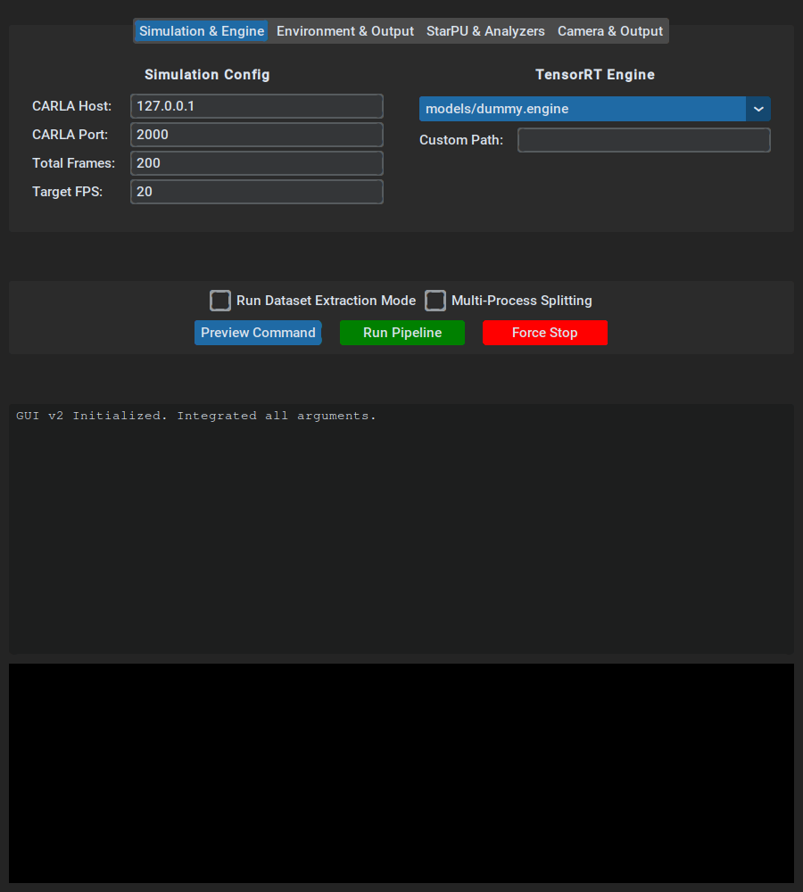
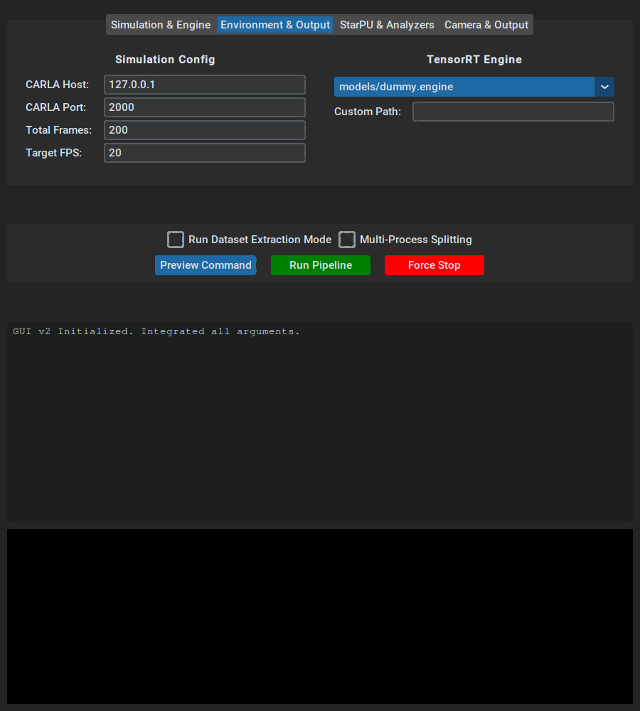
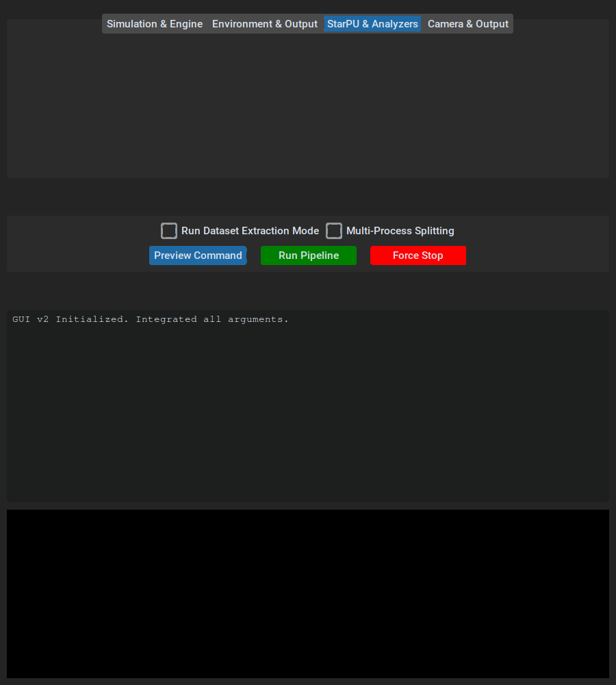
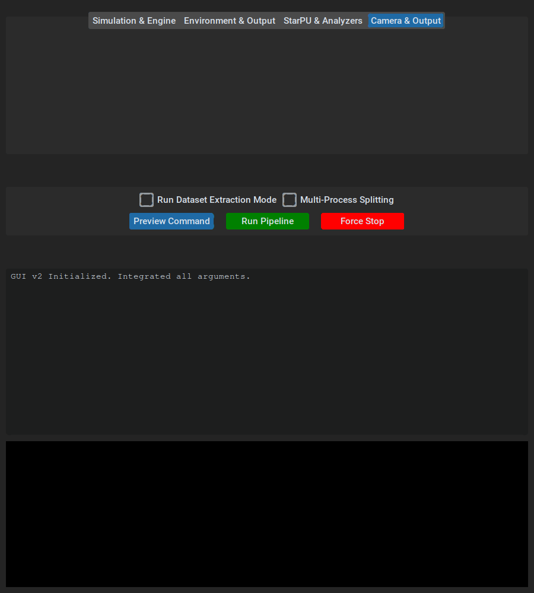
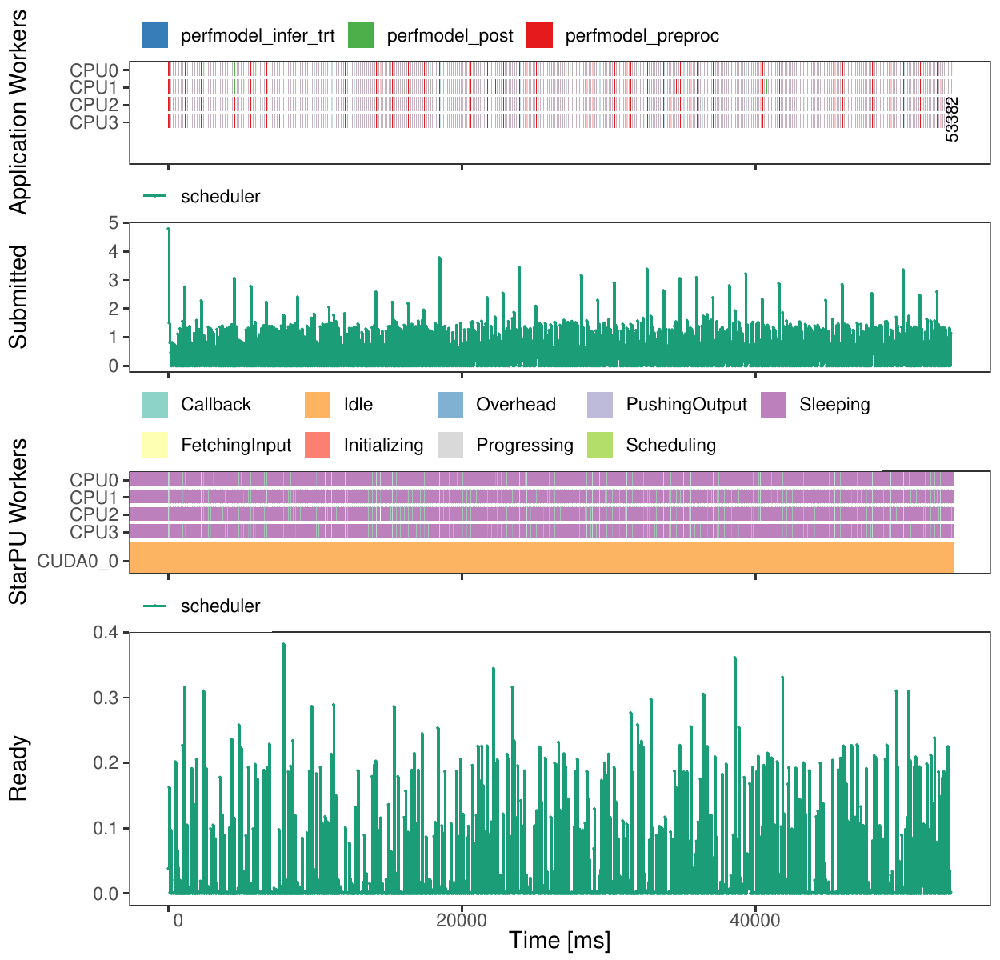
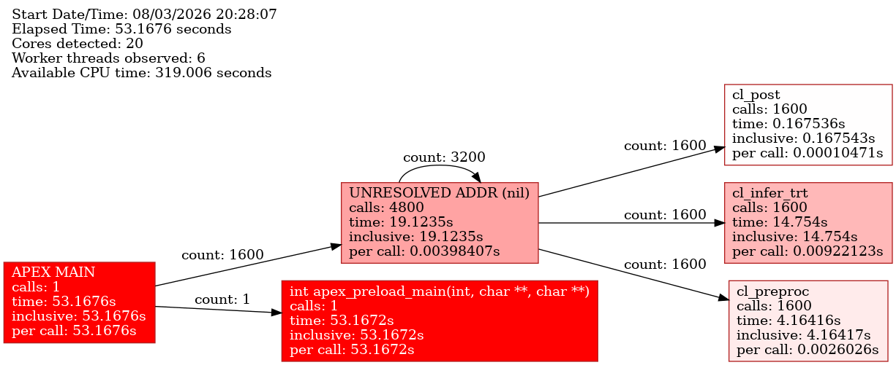

# Cart_OnePiece Autonomous Simulation Pipeline

Welcome to the **Cart_OnePiece** repository! This project hosts a high-performance, distributed, and advanced toolchain connecting CARLA Autonomous Driving simulations with StarPU task-based profiling and evaluation engines.

## 🚀 Features
- **Dynamic 360-Degree Camera Pipelines:** Configure and capture data from 1 to 8 simultaneous cameras.
- **Deep StarPU Integration:** Harness advanced task-based scheduling, execution, and profiling (using `dmda`, `eager`, `rr_workers`, etc.).
- **User-Friendly Python GUI:** A comprehensive standalone Tkinter-based launcher (`gui_launcher.py`) that handles Simulation, Environment, StarPU Analyzers, and Visual Output cleanly.
- **Automated Directory Consolidation:** Auto-generated clean output folder hierarchies based on the execution mode (e.g., `dataset`, `profile`, `sweep`).

---

## 📸 GUI Manual & Examples

The pipeline is driven by an intuitive Configuration GUI. Below is a breakdown of the available tabs and how to use them.

### 1. Simulation & Engine
Configure the core simulation parameters, framerates, target inference engine, and multi-process splitting.


### 2. Environment & Output
Set custom output directories, map selection (e.g., `Town03_Opt`), and control the density of CARLA vehicles and pedestrians.


### 3. StarPU & Analyzers
Choose your scheduling algorithm (`dmda`, `eager`, `rr_workers`, etc.), execute automated sweeps, manage in-flight tasks, and configure APEX/PAPI trace generation.


### 4. Camera & Output Details
Easily toggle between multiple camera sensors, adjust output resolutions, and enable the live SDL2 semantic tracking display.


---

## 📁 Result Output Structures

Every execution natively bundles its artifacts into dynamically generated timestamped folders under `runs/`, so datasets and profiling traces never conflict.

Example profile and dataset runs included in this repository can be found in the [result_example/](Cart-OnePiece_Antigravity_C++/starpu_adv_pipeline_client/result_example/) directory:
- **Dataset Generation Run**: Extracted sensor arrays without performance analytics.
- **StarPU Profiles**: Comprehensive tracing graphs, FxT metrics, DAG analysis, and dashboards utilizing `dmda`, `rr_workers`, and `eager` schedulers.

### StarVZ Visualization
Interactive application dashboards highlighting task distribution across CPU/GPU metrics natively in the UI.


### APEX TaskGraph Analysis
Fine-grained APEX workflow visualization outlining task queues and runtime dependency graphs.


### GraphViz Codelet DAG
Extensive direct acyclic graphs exported automatically showcasing task parallelism.


## 🛠 Getting Started

Launch the configuration interface by running:
```bash
cd Cart-OnePiece_Antigravity_C++/starpu_adv_pipeline_client/
python3 tools/gui_launcher.py
```
